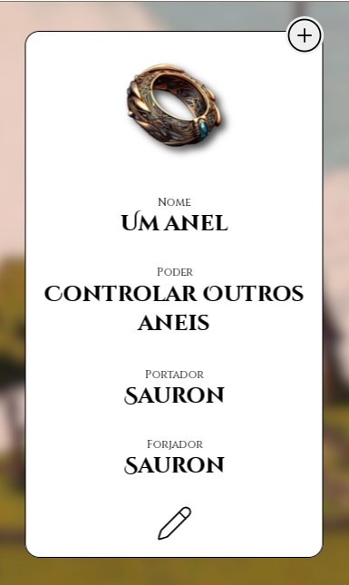
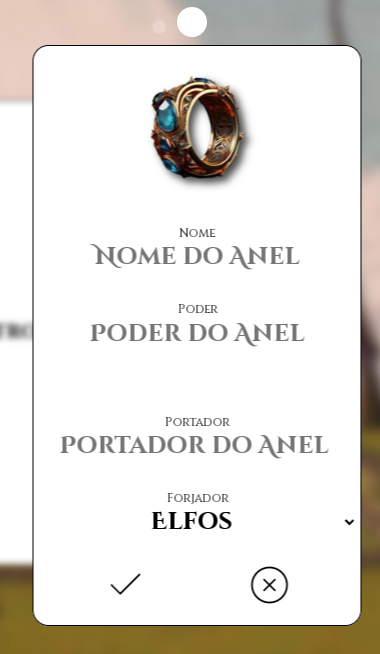
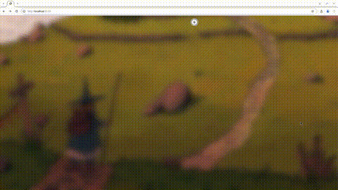
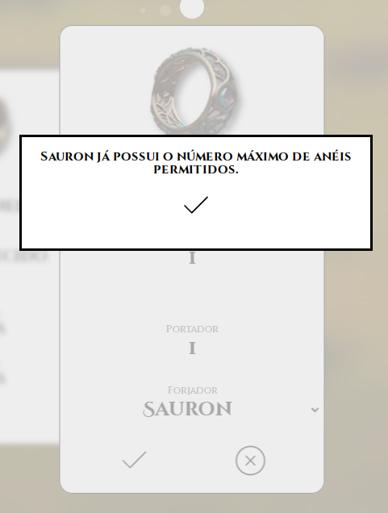
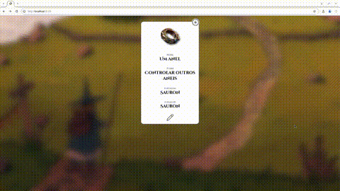

# Projeto Frontend - React + TypeScript + Vite

Este projeto é uma aplicação frontend desenvolvida com React e TypeScript, utilizando o Vite como build tool para um desenvolvimento mais rápido e otimizado.

## Tecnologias Utilizadas

- **React**: Biblioteca JavaScript para construir interfaces de usuário.
- **TypeScript**: Superset de JavaScript que adiciona tipagem estática.
- **Vite**: Ferramenta de build rápida e leve para desenvolvimento frontend.

## Funcionalidades

- Estrutura de projeto escalável com componentes React.
- Suporte completo a TypeScript.
- Performance otimizada utilizando Vite.

## Instalação e Configuração

### Pré-requisitos

- [Node.js](https://nodejs.org/)
- [npm](https://www.npmjs.com/) ou [yarn](https://yarnpkg.com/)

### Passos para Instalação

1. Clone o repositório:

   ```bash
   git clone https://github.com/usuario/projeto-frontend.git
   
2. Rode o projeto
    ```bash
      cd projeto-frontend/AneisdoPoder
      npm run dev
      ```

### Telas
#### Card



#### Edição



#### Erro


