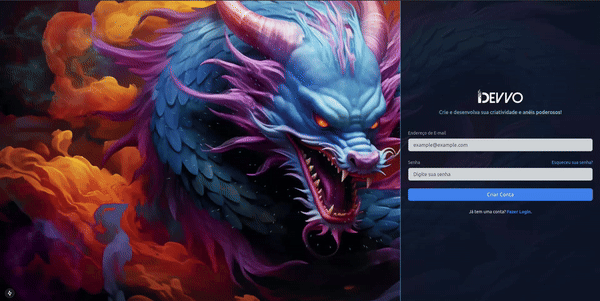
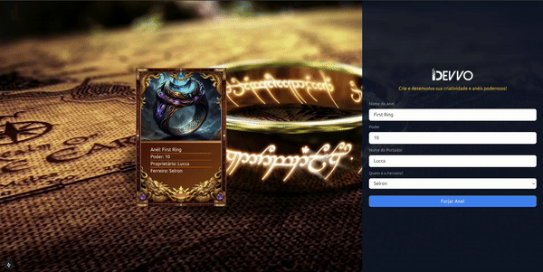

# Desafio Finalizado - Devvo

Esse projeto foi desenvolvido com muita dedicação e cuidado nos detalhes para os maiores estusiastas do Senhor dos Anéis.

_Recomendo a utilização do Mozilla Firefox para as animações funcionarem perfeitamente._


---

## Índice

- [Desafio Finalizado - Devvo](#desafio-finalizado---devvo)
  - [Índice](#índice)
  - [Sobre o Projeto](#sobre-o-projeto)
  - [Lobby Principal](#lobby-principal)
  - [O Ferreiro está a postos](#o-ferreiro-está-a-postos)
  - [Calabouço das Jóias Fantásticas](#calabouço-das-jóias-fantásticas)
  - [Tecnologias Utilizadas](#tecnologias-utilizadas)
  - [Instalação do Back-End](#instalação-do-back-end)
    - [Uso do Back-End:](#uso-do-back-end)
  - [Instalação do Front-End](#instalação-do-front-end)
    - [Uso do Front-End:](#uso-do-front-end)
    - [Endpoints](#endpoints)
  - [Contato](#contato)

---



## Sobre o Projeto

- Foram desenvolvidas as telas de autenticação de SignIn e SignUp (apenas Front-End).
- Uma tela de listagem de todos os anéis que foram criados.
- Uma tela de criação de novos anéis.

---


## Lobby Principal

Aqui onde apresentará os anéis mais poderosos que você irá presenciar em sua vida.

Enquanto a forja está prestes a acender, aprecie a vista da entreda do reino (caso fique entendiado entre na aba de "Criação de Anéis").

---



## O Ferreiro está a postos

Aqui onde a brincadeira começa, você tem a possibilidade de escolher todos os detalhes do anél mais poderoso da Terra - ou pelo menos da sua região.

---


## Calabouço das Jóias Fantásticas

Vocẽ precisa de um local apropriado para guardar-las de possíveis saques de "goblins".

Por quê não escondê-las justamente onde os seus inimigos não irão encontrá-las?

---

## Tecnologias Utilizadas

Este projeto foi desenvolvido com as seguintes tecnologias e ferramentas:

- **NestJS**
- **TypeORM**
- **ReactJS** (configuração realizada através do NextJS)
- **TailwindCSS** (estilização).
- **SQLite**

## Instalação do Back-End

Siga as instruções abaixo para configurar o projeto em seu ambiente local.

1. Clone o repositório:

   ```bash
   git clone https://github.com/luccameds/Junior-Challenge.git
   ```

2. Navegue até o diretório do backend:

   ```
   cd backend
   ```

3. Instale as dependências do backend:
   ```
   yarn
   ```

### Uso do Back-End:

```
yarn start:dev
```

Acesse primeiro backend para definir a porta para http://localhost:3000.

## Instalação do Front-End

2. Navegue até o diretório do front-end:

   ```
   cd frontend
   ```

3. Instale as dependências:
   ```
   yarn
   ```

### Uso do Front-End:

```
yarn dev
```

Verifique que o local foi definido para:

- Local: http://localhost:3001

Após a execução do projeto, entre em "http://localhost:3001".

### Endpoints

```
     GET /cards - Retorna a lista de anéis
     POST /cards - Cria um novo anél
     DELETE /cards/{:id} - Deleta determinado anél
```

## Contato

Lucca Medeiros - dev.luccameds@gmail.com
