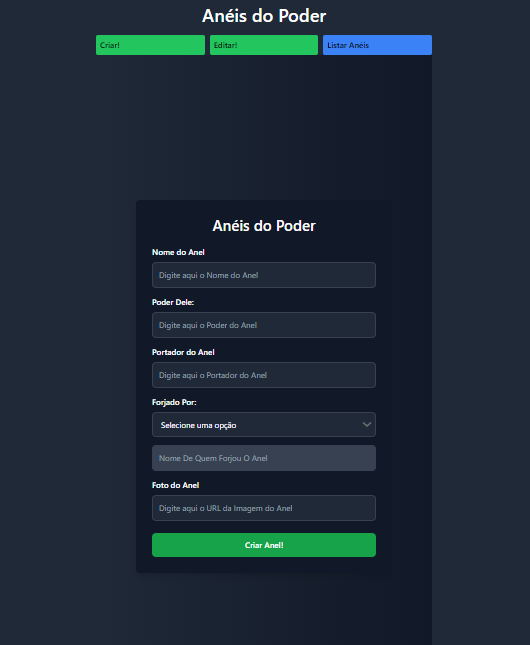
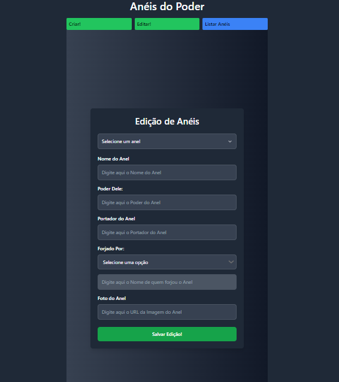
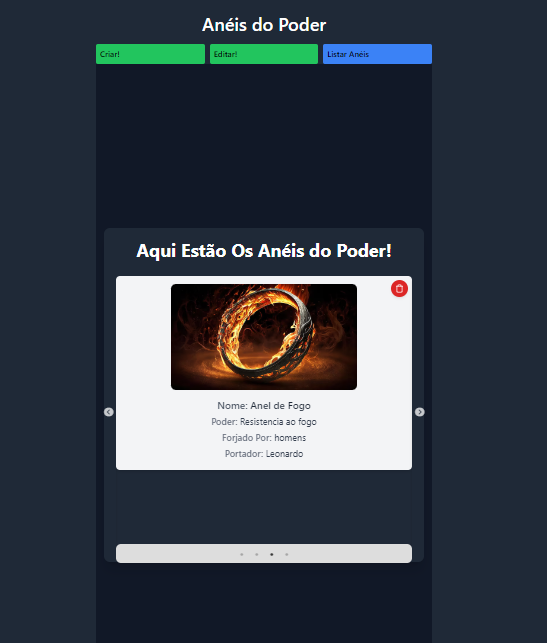

<!-- # Desafio Fullstack: Os Anéis de Poder
_One Challenge to rule them all, One Challenge to find them, One Challenge to bring them all, and in the darkness bind them_

## 💍 Contexto do Desafio

O grande mago J.R.R. Tolkien nos deixou a famosa frase:

> **Three Rings for the Elven-kings under the sky,  
> Seven for the Dwarf-lords in their halls of stone,  
> Nine for Mortal Men doomed to die,  
> One for the Dark Lord on his dark throne  
> In the Land of Mordor where the Shadows lie.  
> One Ring to rule them all, One Ring to find them,  
> One Ring to bring them all, and in the darkness bind them  
> In the Land of Mordor where the Shadows lie.**

Sua missão será criar um CRUD (Create, Read, Update, Delete) para gerenciar os anéis e desenvolver um frontend para visualizar e manipular essas informações.

## 🎯 Objetivo

### Backend
Criar uma API em **Node.js** com **TypeScript** para realizar as seguintes operações:

- **Criar** (POST) um novo anel.
- **Listar** (GET) todos os anéis.
- **Atualizar** (PUT) as informações de um anel.
- **Deletar** (DELETE) um anel existente.

### Frontend
Desenvolver uma interface simples em **React** com as seguintes telas:

- **Tela de Criação/Atualização**: Formulário para criar um novo anel ou atualizar um anel existente.
- **Tela de Visualização**: Exibição dos anéis criados em um **carrossel**, mostrando as informações de cada anel (nome, poder, portador, forjadoPor e imagem).

## ⚔️ Requisitos Funcionais

### Backend

1. **Criar um Anel**  
   O anel deverá ter as seguintes propriedades:
   - `nome`: Nome do anel (ex: "Narya, o anel do fogo").
   - `poder`: Uma breve descrição do poder do anel (ex: "Seu portador ganha resistência ao fogo").
   - `portador`: O nome do portador atual (Ex: Gandalf).
   - `forjadoPor`: Quem forjou o anel (ex: Elfos).
   - `imagem`: URL de uma imagem genérica do anel.

2. **Regras de Negócio para Criação de Anéis**  
   A API deverá garantir que a quantidade máxima de anéis criados respeite as seguintes regras:
   
   - **Elfos**: No máximo 3 anéis.
   - **Anões**: No máximo 7 anéis.
   - **Homens**: No máximo 9 anéis.
   - **Sauron**: Apenas 1 anel.

   Caso o limite seja excedido, a criação deve ser rejeitada com uma mensagem de erro adequada.

3. **Listar os Anéis**  
   A API deverá retornar uma lista com todos os anéis e suas propriedades.

4. **Atualizar um Anel**  
   Deve ser possível atualizar as informações de um anel específico (ex: alterar o portador ou a descrição do poder).

5. **Deletar um Anel**  
   Deve ser possível remover um anel do banco de dados.

### Frontend

1. **Tela de Criação/Atualização de Anel**  
   - Um formulário com os seguintes campos:
     - `nome`: Campo de texto para o nome do anel.
     - `poder`: Campo de texto para a descrição do poder do anel.
     - `portador`: Campo de texto para o nome do portador.
     - `forjadoPor`: Campo de texto para indicar quem forjou o anel.
     - `imagem`: Como a imagem vai ser genérica você pode tanto deixar o uauário escolher entre as imagens que o próprio sistema fornece ou remover esse campo e deixar uma imagem default.
   - Botões para:
     - **Criar**: Submeter o formulário para criar um novo anel.
     - **Atualizar**: Alterar as informações de um anel existente.

2. **Tela de Visualização dos Anéis**
   - Exibir todos os anéis em um **carrossel** (ou grid), mostrando:
     - Nome, poder, portador, forjadoPor, e a imagem do anel.
   - O carrossel deve ser responsivo e permitir rolar entre os anéis cadastrados.
   - Adicionar a possibilidade de **excluir** ou **editar** um anel diretamente dessa tela.

## 🚀 Tecnologias

- **Backend**:
  - **Node.js** com **TypeScript**
  - **Express** (ou outro framework para criar a API)
  - **Banco de Dados**: MySQL, PostgreSQL, MongoDB, etc.
  - **ORM/ODM**: Sequelize, TypeORM ou Mongoose.

- **Frontend**:
  - **React**
  - **Biblioteca para Carrossel**: Você pode utilizar bibliotecas como `react-slick` ou outra para implementar o carrossel.

## 🛠️ Instruções

1. Faça o **fork** deste repositório.
2. Crie uma nova branch com o nome do seu desafio: `git checkout -b desafio-seu-nome`.
3. Implemente sua solução backend e frontend conforme os requisitos descritos.
4. Faça o **commit** das suas alterações: `git commit -m 'Desafio finalizado'`.
5. Faça o **push** para a branch criada: `git push origin desafio-seu-nome`.
6. Crie um **Pull Request** para o repositório principal.
7. Envie um email para "contato@devvo.com.br" falando que finalizou seu desafio e encaminhando o link do Pull Request

## 📝 Regras e Critérios de Avaliação

1. **Organização do código**: Estrutura clara e modularidade do código.
2. **Boas práticas**: Uso de boas práticas de desenvolvimento, como SOLID e DRY.
3. **Frontend**: Interface limpa, funcional e interativa (carrossel funcionando corretamente).
4. **Validação da Regra de Negócio**: Implementação correta da validação do limite de anéis por portador.
5. **Testes**: Testes unitários e/ou de integração serão um diferencial.
6. **Documentação**: Adicione uma breve documentação da API e do frontend (pode ser no próprio README ou em uma ferramenta como Swagger).

## 🔥 Desafios Extras (Opcional)

Se quiser ir além, aqui estão algumas sugestões de funcionalidades extras:

- **Autenticação**: Implemente um sistema de autenticação (JWT, OAuth, etc.).
- **Relacionamentos entre entidades**: Adicione relacionamentos entre os anéis e seus portadores (Ex: um portador pode ter mais de um anel, ou um anel pode ter sido passado por diferentes portadores ao longo do tempo).
- **Animações no Frontend**: Adicione animações ao carrossel ou à interface de criação de anéis.
- **Responsividade Avançada**: Certifique-se de que o carrossel e todas as funcionalidades são totalmente responsivas em diferentes dispositivos.

## 🧙‍♂️ Dicas

- Divida a lógica do backend em camadas (Controllers, Services, Models).
- Utilize hooks e componentes funcionais no frontend para um código mais limpo.
- Utilize **TypeScript** tanto no backend quanto no frontend para garantir tipagem estática.
- Planeje a interface para ser intuitiva e simples de usar.

## 🧭 Referências

- [Documentação do Node.js](https://nodejs.org/en/docs/)
- [Documentação do TypeScript](https://www.typescriptlang.org/docs/)
- [Documentação do React](https://reactjs.org/docs/getting-started.html)

---

_May the Light of Eärendil guide you in this challenge!_ -->

## Projeto Anéis do Poder 🔮
 - Este projeto é uma aplicação para gerenciar anéis mágicos, permitindo a criação, visualização e edição dos  - anéis com informações detalhadas. O sistema é construído com as seguintes tecnologias:

## Tecnologias Utilizadas 🛠️
 - TypeScript: Para garantir a segurança e robustez do código tanto no backend quanto no frontend.
 - MongoDB: Banco de dados NoSQL para armazenar informações dos anéis.
 - Prisma: ORM para facilitar o gerenciamento e a consulta dos dados no MongoDB.
 - Fastify: Framework rápido e eficiente para criar APIs no backend.
 - React: Biblioteca para construir a interface do usuário no frontend.
 - Node.js: Ambiente de execução para o backend.
 - Tailwind CSS: Framework de CSS para estilização moderna e responsiva.

 ## 🛠️ API
A API é a parte central do sistema, responsável por gerenciar todas as operações relacionadas aos anéis mágicos. A seguir, você encontrará uma visão geral dos principais endpoints disponíveis.

1. Endpoints de Anéis
Obter Lista de Anéis: Este endpoint permite que você recupere uma lista de todos os anéis registrados no sistema. Ele fornece informações gerais sobre cada anel, como nome, poder, portador, forjador e imagem.

Obter Detalhes de um Anel: Utilizando este endpoint, você pode buscar detalhes específicos de um anel, fornecendo seu ID. As informações retornadas incluem nome, poder, portador, forjador e imagem do anel.

Criar um Novo Anel: Este endpoint é utilizado para adicionar um novo anel ao sistema. Você deve fornecer o nome, poder, portador, forjador e imagem do anel. Após a criação, o sistema retorna os dados do anel recém-criado.

Atualizar um Anel: Com este endpoint, é possível atualizar as informações de um anel existente, fornecendo seu ID e os novos dados para nome, poder, portador, forjador e imagem.

Excluir um Anel: Este endpoint remove um anel específico do sistema usando seu ID. Após a exclusão, uma mensagem de confirmação é retornada.

2. Endpoints de Contagem
Obter Contagem de Anéis por Forjador: Este endpoint permite verificar quantos anéis foram registrados para um tipo específico de forjador (elfos, anões, homens, ou Sauron). Ele ajuda a controlar o limite de anéis permitidos para cada forjador.

## 🧪 Testes
Para testar os endpoints da API, utilizei a ferramenta Postman. Essa ferramenta ajuda a garantir que todos os endpoints estejam funcionando conforme esperado.

Configure o Ambiente:

Crie um arquivo .env na pasta backend baseado no arquivo .env.example. Atualize com as configurações do MongoDB

Sim, incluir uma seção sobre as telas do sistema é uma ótima ideia para fornecer uma visão completa sobre a interface do usuário. Vou criar uma seção de Telas para o README, detalhando as principais telas e suas funcionalidades:

## 📱 Telas
1. Tela de Criação de Anéis
Nesta tela, os usuários podem adicionar novos anéis ao sistema. A interface inclui campos para inserir o nome do anel, seu poder, o portador, o forjador e o URL da imagem do anel. Há também um menu suspenso para selecionar o tipo de forjador (elfos, anões, homens, ou Sauron). Após preencher todos os campos obrigatórios, o usuário pode salvar o novo anel.

Nome do Anel: Campo para inserir o nome do anel.
Poder do Anel: Campo para descrever o poder do anel.
Portador do Anel: Campo para especificar quem é o portador do anel.
Forjado Por: Menu suspenso para selecionar o tipo de forjador.
Nome de quem forjou o Anel: Campo que é automaticamente preenchido com base na seleção do menu suspenso.
Foto do Anel: Campo para inserir o URL da imagem do anel.
Botão de Salvar: Salva o novo anel no sistema.

2. Tela de Edição de Anéis
A tela de edição permite que os usuários atualizem as informações de um anel existente. Os campos são pré-preenchidos com os dados atuais do anel, e os usuários podem modificar qualquer informação antes de salvar as alterações.

Seleção de Anel: Menu suspenso para selecionar o anel a ser editado.
Campos de Edição: Campos preenchidos com os dados atuais do anel que podem ser alterados (nome, poder, portador, etc.).
Botão de Salvar: Atualiza as informações do anel no sistema.
3. Tela de Visualização de Anéis
Esta tela exibe uma lista ou um carrossel com todos os anéis registrados. Cada item na lista mostra uma imagem do anel e suas informações básicas, como nome, poder, portador e forjador. A interface é interativa e pode incluir botões para editar ou excluir anéis.

Carrossel de Anéis: Exibe todos os anéis em um formato visualmente atraente.
Informações do Anel: Exibe o nome, poder, portador e forjador do anel.
Botão de Excluir: Permite remover um anel da lista.
Botão de Editar: Permite acessar a tela de edição para modificar as informações do anel.

