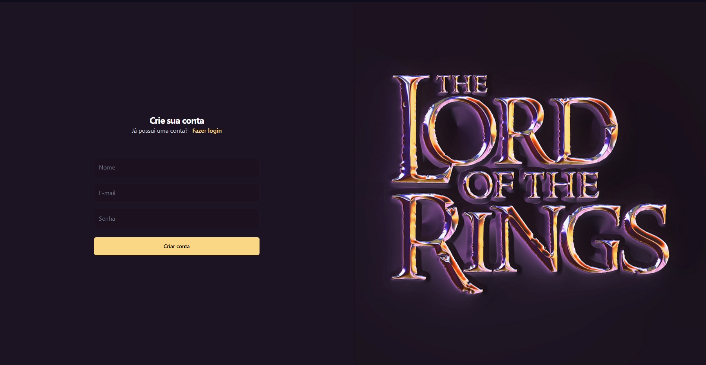
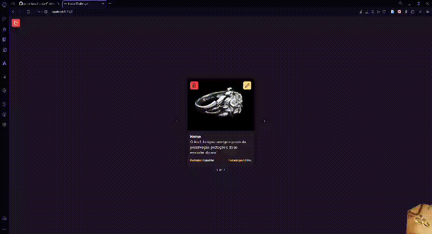
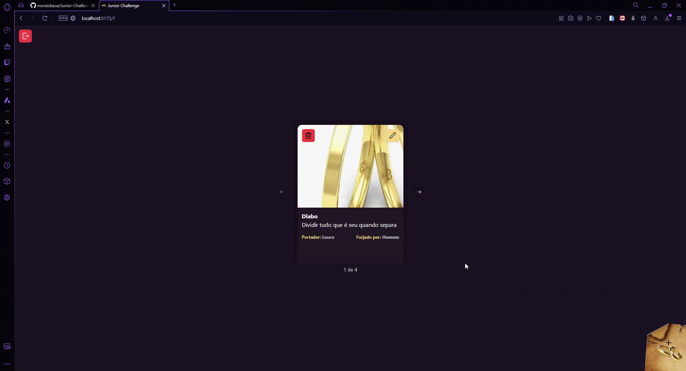

# Desafio Fullstack: Anéis de Poder

## 💡 Visão Geral

Implementei uma aplicação full-stack com um **backend** em Node.js (TypeScript) e um **frontend** em React (Vite + TypeScript), atendendo a todos os requisitos do desafio.

## 📸 Imagens e Vídeos

<table>
  <tr>
    <td></td>
    <td></td>
  </tr>
  <tr>
    <td align="center"><strong>Login</strong></td>
    <td align="center"><strong>Create</strong></td>
  </tr>
  <tr>
    <td></td>
    <td></td>
  </tr>
  <tr>
    <td align="center"><strong>Update</strong></td>
    <td align="center"><strong>Delete</strong></td>
  </tr>
</table>

## 🛠️ Tecnologias Utilizadas

### Backend:
- **Node.js** com **TypeScript**
- **Express**
- **Prisma ORM** para interação com o banco de dados
- **PostgreSQL**
- **JWT** para autenticação
- **Zod** para validação

### Frontend:
- **React** com **Vite** e **TypeScript**
- **React Router Dom** para navegação
- **TanStack Query** para requisições assíncronas
- **React Hook Form** para formulários
- **Tailwind CSS** para estilização
- **Zod** para validações
- **Toasts** para notificações

## 🎯 Funcionalidades Implementadas

### Backend:
- CRUD completo de anéis
- Autenticação com JWT
- Validações com Zod
- Limites de criação de anéis (Elfos, Anões, Homens, Sauron)

### Frontend:
- Formulários com validação e animações
- CRUD de anéis via interface simples
- Validações com Zod
- Carrossel para exibição de anéis
- Sistema de **notificações toast** para feedback ao usuário

## 📂 Estrutura do Projeto

### Backend:
- **Controllers**: Responsáveis por tratar as requisições.
- **Services**: Contêm a lógica de negócio e comunicação com o banco de dados.
- **Prisma ORM**: Facilita a interação com o banco de dados, criando queries tipadas automaticamente com base no schema.
- **Validação**: Feita com **Zod** tanto no frontend quanto no backend.

### Frontend:
- **Componentes Funcionais**: Separados por responsabilidade (UI e lógica).
- **Animações**: Implementadas nos inputs e toasts.
- **Arquitetura**: Lógica separada dos componentes em custom hooks e **services** para requisições HTTP.

---

Esse projeto cumpre todos os requisitos do desafio, com foco em boas práticas, organização do código e utilização de ferramentas modernas.
