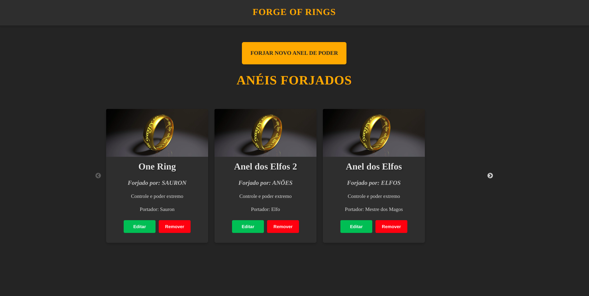

# Forged of Rings

**Forged of Rings** é uma aplicação fullstack desenvolvida para gerenciar os anéis de poder, inspirada no universo de J.R.R. Tolkien. O projeto é composto por uma API backend em Nest.js com TypeScript e um frontend em React, permitindo a criação, visualização, atualização e remoção dos anéis lendários. O sistema foi desenhado com base nas regras de negócio do mundo de Tolkien, respeitando os limites de anéis forjados para Elfos, Anões, Homens e Sauron.
## 📖 Índice

- [Tecnologias utilizadas](#-tecnologias-utilizadas)
- [Funcionalidades desenvolvidas](#-funcionalidades-desenvolvidas)
- [Testando a API com o Swagger](#-testando-api-com-swagger)

## 🛠️ Tecnologias utilizadas

- **Typescript**
    - Linguagem de programação utilizada
- **Nest.JS**
    - Base do projeto
- **PostgreSQL**
    - Banco de Dados NoSQL utilizado
- **ReactJS**
    - Lib Frontend utilizada para montar a interface do projeto
- **Docker**
    - Criação dos containers utilizados, facilita a configuração das ferramentas e facilita a implantação do sistema
- **Docker Compose**
    - Gerenciador de containers Docker, facilita a execução de vários containers necessários para o sistema

## 🚀 Funcionalidades desenvolvidas

- [x] CRUD de *Anéis de Poder* - Onde é possível Listar, Buscar, Cadastrar, Atualizar e Remover
- [x] Lógica de validação da quantidade de Anéis de Poder já cadastrados
- [x] Troca do Portador do Anel de Poder
- [x] Histórico dos Portadores do Anel de Poder
- [x] Frontend com as funcionálidades do CRUD

## 📝 Testando API com Swagger

Com o sistema em execução, em seu navegador digite a seguinte URL para abrir a documentação da aplicação

[http://localhost:3000/api#/](http://localhost:3000/api#/)
