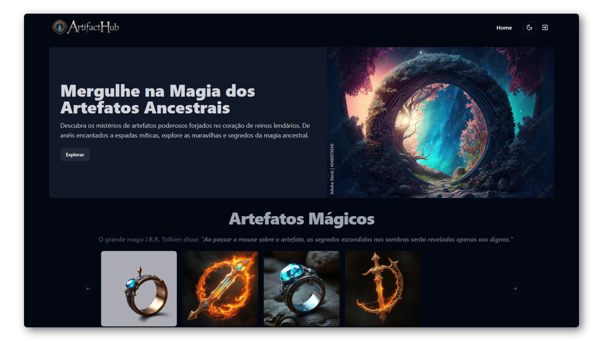
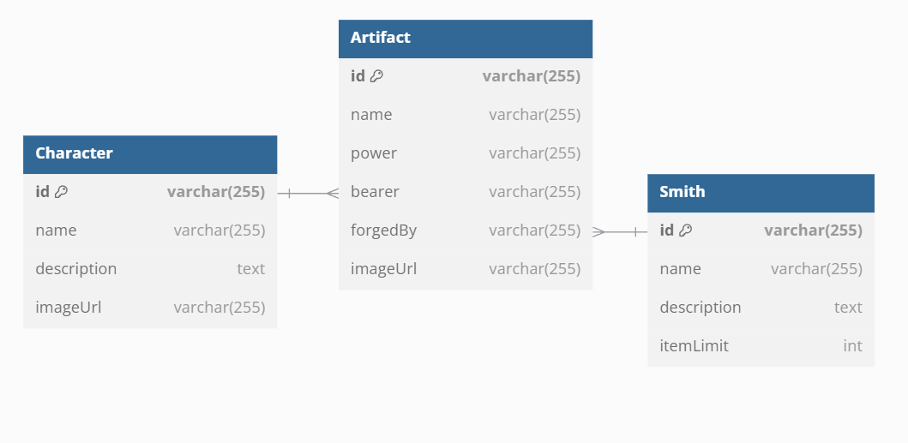

<h1 align="center">

Teste para Desenvolvedor Júnior</h1>

    
    
    
    

## :page_with_curl: Descrição

O desafio "Os Anéis de Poder" é uma missão épica para desenvolver uma aplicação web fullstack, seguindo a temática imortal de J.R.R. Tolkien. A tarefa é criar uma plataforma que permita gerenciar e visualizar os lendários anéis de poder, combinando um backend robusto com uma interface frontend interativa.

## :dart: Níveis

- [x] API REST
- [x] Front-end com React
- [x] Gerar imagens com IA
- [x] Autenticação com JWT

## :bulb: Resolvendo o desafio

No desenvolvimento do sistema de artefatos mágicos, segui uma abordagem centrada em três entidades principais: `Artifact`, `Smith` e `Character`. Essa estrutura permitiu representar de forma clara a relação entre artefatos, seus criadores e portadores. Os artefatos, forjados por ferreiros (Smiths), podem ser atribuídos a personagens (Characters), e toda a lógica de criação e gerenciamento desses relacionamentos foi concentrada na API. Com mais tempo, seria possível expandir o sistema, implementando funcionalidades como controle avançado de permissões, histórico de posse dos artefatos, além de tratamento robusto de erros e logs detalhados.

## :pushpin: Requisitos

- [Node.js](https://nodejs.org/en)

## :computer: Acesse em produção

> https://artifact-hub.vercel.app/

#### Frontend

  
  
  
  
  
  
  
  

#### Backend

  
  
  
  
  
  

## :bookmark_tabs: Licença

Este projeto está sob licença MIT. Consulte `LICENSE` para mais informações.

## :adult: Autores

<!-- ALL-CONTRIBUTORS-LIST:START - Do not remove or modify this section -->
<!-- prettier-ignore-start -->
<!-- markdownlint-disable -->
<table>
  <tbody>
    <tr>
      <td align="center" valign="top" width="14.28%"><a href="https://gustavohenrique.vercel.app/"> <b>Gustavo Henrique</b></a> <a href="#code-Gustavohps10" title="Code">💻</a></td>
    </tr>
  </tbody>
</table>

<!-- markdownlint-restore -->
<!-- prettier-ignore-end -->

<!-- ALL-CONTRIBUTORS-LIST:END -->
